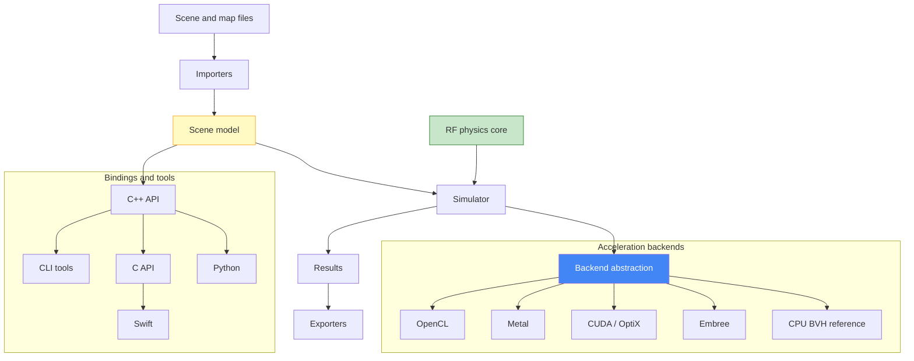

# RFTraceKit

[](https://github.com/CyberdyneCorp/RFRayTracingKit/actions/workflows/ci.yml)
[](LICENSE)


Modern **C++20** library for general **ray tracing** and **RF propagation simulation**
(4G/5G/6G and above). Give it a 3D scene (buildings, terrain, materials) plus transmitters and
receivers, and it computes propagation paths, received power, path loss, delay, phase, and multipath —
and exports the results for external visualization.

RF physics lives in a single **backend-agnostic core**; ray traversal is delegated to a pluggable
`IBackend` (a portable CPU BVH by default, or Embree, CUDA/OptiX, Metal, or OpenCL). The pure-C++ CPU
backend is always available and is the reference every other backend is validated against, so a build
with no GPU and no optional dependencies still runs everything.

## Architecture



| Stage | What it does |
|-------|--------------|
| **Importers** | Meshes (glTF/OBJ), GeoJSON, CityJSON, OSM, MSI antennas, GeoTIFF/DEM terrain, materials |
| **Scene model** | Triangles + materials, transmitters/receivers, antenna patterns, Z-up georeferenced frame |
| **RF physics core** | FSPL, reflection, diffraction, attenuation, polarization, Doppler, MIMO, SINR |
| **Backends** | Ray traversal behind `IBackend`; CPU is the reference, others accelerate/validate against it |
| **Simulator** | `run` (point receivers), `runCoverage` (grid), `runRoute` (moving receiver) |
| **Exporters** | JSON, CSV, GeoJSON, glTF, CZML, 3D Tiles, GeoTIFF heatmap, Parquet |
| **Bindings & tools** | Python (pybind11), a stable C API, a Swift package, and CLI executables |

## Features

### Scene & geometry
- Backend-agnostic **scene model** — meshes, materials (with built-in presets), transmitters,
  receivers, antenna patterns, a right-handed **Z-up** coordinate system.
- **Core geometry** — Eigen-based `Vec3`/`Ray`/`Triangle`/`AABB`, Möller–Trumbore intersection, and a
  NanoRT-style **BVH** with closest-hit and occlusion queries.
- **Import** — triangle meshes (glTF/OBJ via Assimp, normalized to Z-up), **GeoJSON**, **CityJSON**,
  **OSM** (Overpass JSON and `.osm` XML always on; `.osm.pbf` behind `RFTRACE_ENABLE_OSMIUM`), **MSI**
  antenna patterns, and **GeoTIFF/DEM terrain** (behind `RFTRACE_ENABLE_GDAL`). A scene georeference
  projects all geospatial data into the local ENU frame.

### RF physics
- **Propagation** — free-space path loss, Fresnel reflection, penetration loss, phase, delay, antenna
  gain, and coherent/incoherent power aggregation.
- **Diffraction** — ITU-R P.526 single knife-edge and multi-edge (Bullington / Deygout), plus a
  **geometry-driven UTD** model: it extracts the real wedge angle from the mesh dihedral (a 90° corner
  → `n = 1.5`, a free edge → half-plane `n = 2`), computes loss from the Kouyoumjian–Pathak wedge
  coefficient with spherical spreading, and additively cascades UTD over the terrain profile for
  doubly-obstructed links. It reduces to the ITU-R knife edge in the half-plane limit and is validated
  by reciprocity, shadow-boundary continuity, and monotonic shadowing.
- **Atmospheric & vegetation attenuation** — rain (P.838), gaseous (P.676), and foliage
  (Weissberger / P.833) along path length.
- **Polarization** — polarization mismatch and depolarizing reflection (per-bounce Fresnel Jones).
- **Antenna arrays & MIMO** — ULA/UPA array factor and beam steering; MIMO channel matrix, narrowband
  capacity, and per-stream SINR.
- **Cell planning / SINR** — serving-cell selection and SINR = S/(I+N) with a physical noise floor
  `N = kTB + NF`, plus SINR coverage maps.

Every advanced-RF feature is **additive and default-off** — with default settings, results match the
baseline (enforced by regression tests); knife-edge remains the default diffraction model.

### Simulation modes
- **Point receivers** — `Simulator::run`: line-of-sight + specular reflections (image method, up to
  `maxReflections`), with per-receiver power / path loss / delay spread.
- **Coverage grid** — `Simulator::runCoverage`: received power over a georeferenced 2D grid, with a
  no-signal sentinel and optional SINR.
- **Route** — `Simulator::runRoute`: a moving receiver sampled along waypoints → an ordered drive-test
  series with per-sample Doppler.
- **Stochastic ray launch** — Monte-Carlo Fibonacci-sphere ray launching with multi-bounce specular
  tracing and a receiver capture sphere; deduplicated and seed-reproducible. The deterministic image
  method remains the correctness oracle.

### Acceleration backends
All backends implement the same `IBackend` traversal contract; RF physics stays backend-agnostic, and
public types stay double precision (values convert to float only inside device buffers). Selection
falls back to CPU when the requested backend is unavailable.

| Backend | Flag | Notes |
|---------|------|-------|
| **CPU BVH** | (always) | Portable pure-C++20 reference and universal fallback; the parity oracle. |
| **Embree** | `RFTRACE_ENABLE_EMBREE` | Intel Embree 4 SIMD BVH; CPU, thread-safe; ~5× the reference BVH. |
| **CUDA / OptiX** | `RFTRACE_ENABLE_CUDA` | RT-core hardware ray tracing; verified on an RTX 5060. |
| **Metal** | `RFTRACE_ENABLE_METAL` | Apple `MTLAccelerationStructure` + compute kernel. |
| **OpenCL** | `RFTRACE_ENABLE_OPENCL` | Portable custom flat-BVH traversal kernel (OpenCL 1.2+). |

Each GPU/Embree backend is validated against the CPU BVH by a **parity suite** (float-vs-double
tolerance `|Δt| ≤ max(1e-2 m, 1e-4·|t|)`, matching triangle indices for well-separated geometry, plus
determinism); parity tests skip at runtime when the device is absent. A **batched, caller-owned-output
query API** (`closestHitBatchInto(rays, std::span<Hit>)` / `occludedBatchInto`) lets the simulator
service whole ray batches in one device dispatch and reuse output buffers across calls.

### Performance & parallelism (all results-preserving)
- **Batched simulator path** — LOS occlusion (across all receivers/cells) and the ray-launch wavefront
  (`closestHit` batched per bounce) collapse a whole run's traversal to a handful of device dispatches
  instead of per-ray round trips.
- **Receiver capture spatial index** — turns the ray-launch `O(rays × receivers)` capture scan
  near-linear (**~31×** on a 25.6k-cell coverage run).
- **Deterministic threading** — `SimulationSettings.threadCount` parallelizes independent
  receivers/cells over cores (bit-for-bit identical to serial; **~2.7–8.5×** on reflection-heavy CPU
  coverage at 24 cores).
- **Backend reuse** — repeated runs on one scene skip the acceleration-structure rebuild.

The end-to-end benchmark (`rftrace_sim_benchmark`) shows a coverage run's GPU traversal is a handful of
dispatches (~1 ms), so for typical scenes full-run wall time is CPU-bound on path processing — which is
what the spatial index, threading, and backend reuse address.

### Export
JSON, CSV, GeoJSON (receivers, paths, coverage), glTF (debug ray paths), **CZML** (Cesium),
**3D Tiles** (single-tile and hierarchical-LOD quadtree), plus **GeoTIFF heatmap** (GDAL) and
**Parquet** (Arrow), the last two flag-gated.

## Examples

### C++

```cpp
#include "rftrace/rftrace.hpp"
using namespace rftrace;

Scene scene;
scene.addMaterial(materials::preset("concrete"));
scene.loadMesh("city.glb", "concrete");            // glTF/OBJ, normalized to Z-up

Transmitter tx;
tx.id = "tower_1";
tx.position = {120.0, 80.0, 35.0};                 // Z is height
tx.frequencyHz = 3.5e9;
tx.powerDbm = 43.0;
scene.addTransmitter(tx);

scene.addReceiver(Receiver{.id = "rx_001", .position = {300.0, 180.0, 1.5}});

SimulationSettings settings;
settings.maxReflections = 3;
settings.threadCount = 0;                          // 0 = all cores, 1 = serial

RFResult result = Simulator(settings).run(scene);
io::exportResultJson(result, "paths.json");
io::exportReceiversCsv(result, "receivers.csv");
```

See `examples/` — `simple_los` (link budget), `city_reflection` (specular reflection),
`coverage_grid` (coverage + CSV/JSON/GeoJSON), `advanced_rf` (diffraction + SINR + route), and the
`cuda_benchmark` / `sim_benchmark` harnesses.

### Python

A pybind11 module plus a pure-Python `rftracekit` package expose the engine; the C++ core stays
Python-free.

```python
import rftracekit as rf

scene = rf.Scene()
scene.add_transmitter(id="tower_1", position=[120, 80, 35], frequency_hz=3.5e9, power_dbm=43)
scene.add_receiver(id="rx_001", position=[300, 180, 1.5])

settings = rf.SimulationSettings(
    backend="embree",              # 'cpu' | 'embree' | 'cuda' | 'metal' | 'opencl' (falls back to CPU)
    mode="raylaunch", max_reflections=3,
    thread_count=0,                # 0 = all cores, 1 = serial (identical results)
    enable_diffraction=True, diffraction_model="utd",  # geometry-driven UTD wedge
)
result = rf.Simulator(settings).run(scene)

df  = result.receivers_dataframe()          # pandas (optional)
pos = result.receiver_positions             # numpy float64[N,3]
result.to_geojson("paths.geojson", kind="paths")
```

NumPy interop (`receiver_positions`, `received_power_dbm`, coverage `coverage_array`), optional pandas
(`receivers_dataframe()`), and lazy visualization helpers (`rftracekit.viz`, `plot_3d`,
`plot_coverage`). Backend selection, deterministic `thread_count` parallelism, and the geometry-driven
UTD model are all reachable from Python — see `examples/backends_and_features` for a runnable showcase.
Build with `just py-build` (needs `python3` + `pybind11` + `numpy`; `-DRFTRACE_ENABLE_PYTHON=ON`).

### Swift

An idiomatic Swift package (`bindings/swift/`) wraps the stable C API (`librftrace_c`) with value
types, `throws`, and RAII.

```swift
import RFTrace

let scene = try Scene()
try scene.addTransmitter(id: "tx", position: Vec3(0, 0, 35), frequencyHz: 3.5e9, powerDbm: 43)
try scene.addReceiver(id: "rx", position: Vec3(300, 180, 1.5))

var settings = Settings()
settings.maxReflections = 3
let result = try Simulator(settings).run(scene)
for rx in result.receivers { print(rx.id, rx.receivedPowerDbm, "dBm") }
```

Build the C API with `just c-api` (`RFTRACE_ENABLE_C_API=ON`), then `swift build` in `bindings/swift/`
against the built `librftrace_c`. See `bindings/c/README.md` and `bindings/swift/README.md`.

### Command line

Three front-end executables (behind `RFTRACE_BUILD_CLI`, default ON) expose the load → simulate →
export flow to the shell, with no new dependency.

```bash
# Point run to JSON, coverage run to CSV (output format inferred from the extension)
rftrace-cli --tx 0,0,10 --rx 50,0,1.5 --out result.json
rftrace-cli --scene city.obj --tx 5,5,20 --grid -50,-50,5,40,40,1.5 --out cov.csv

# Validate a scene; convert a result
rftrace-scene-validator city.obj
rftrace-result-converter --in result.json --out result.csv
```

All tools return `0` on success and non-zero with an `error:` message on bad input or an unavailable
optional feature. Build + smoke-test with `just cli`; see `cli/README.md`.

## Building

Requires CMake ≥ 3.25, a C++20 compiler, and Eigen, Assimp, and nlohmann/json. GoogleTest is fetched
automatically (pinned) unless `-DRFTRACE_USE_SYSTEM_GTEST=ON`. Dependencies resolve via **vcpkg** (set
`VCPKG_ROOT`) or any system package manager through CMake config-mode `find_package`
(e.g. `brew install eigen assimp nlohmann-json`).

### With `just` (recommended)

```bash
# Core (CPU backend — always available, no optional deps)
just build          # configure + compile library, tests, examples
just test           # build + run the unit + golden suite
just ctest          # run the suite through CTest
just examples       # build + run every self-verifying example
just cli            # build + smoke-test the CLI tools
just ci             # clang tests + gcc + asan + openspec validate + examples + cli
just --list         # every recipe with its description

# Probe the host and pick a backend
just gpu-detect     # report usable CUDA / OpenCL / Metal backends (no build)

# Optional acceleration backends (built into separate dirs, run their suites)
just embree         # Intel Embree 4 CPU backend + CPU-vs-Embree parity suite
just cuda-local     # CUDA / OptiX (self-contained: local vcpkg + explicit OptiX SDK)
just metal          # Apple Metal backend (macOS only)
just opencl         # OpenCL backend (needs an OpenCL device)

# Optional IO, bindings, and packaging
just geo            # GDAL (GeoTIFF/DEM) + Arrow/Parquet IO + tests
just io             # all optional IO: GDAL + Parquet + libosmium (OSM PBF)
just c-api          # build librftrace_c + run the C ABI test (Swift's integration point)
just py-build       # build the rftracekit._native Python extension
just py-test        # build + run the Python binding tests
just install prefix=/your/prefix   # install headers + lib + CMake config
```

Debug/sanitizer variants (`just debug`, `just gcc`, `just asan`, `just c-api-asan`) and
single-target helpers (`just lib`, `just example <name>`) are also available — `just --list`
enumerates them all.

### With CMake directly

```bash
cmake -S . -B build -DCMAKE_BUILD_TYPE=Release
cmake --build build
ctest --test-dir build --output-on-failure
```

Optional flags: `-DRFTRACE_ENABLE_METAL/CUDA/OPENCL/EMBREE=ON` (acceleration backends),
`-DRFTRACE_ENABLE_GDAL/PARQUET/OSMIUM=ON` (optional IO), `-DRFTRACE_ENABLE_PYTHON=ON` (Python),
`-DRFTRACE_ENABLE_C_API=ON` (C API / Swift), `-DRFTRACE_BUILD_CLI=OFF` (skip the CLI tools).

Continuous integration (`.github/workflows/ci.yml`) builds the default C++ core, the CLI tools, and the
C API on every push/PR (Ubuntu, clang, vcpkg-cached) and runs the full CTest suite. The GPU backends
and Swift bindings are excluded (no GPU/Swift toolchain on runners) and validated on the appropriate
hardware/toolchain.

## Coordinate convention

The core uses a right-handed **Z-up** frame (Z = height/elevation), matching GIS/Cesium. glTF/OBJ
meshes (Y-up) are rotated to Z-up on import.

## Consuming as an installed library

`just install prefix=/your/prefix` (or `cmake --install build --prefix …`) installs the headers,
the static library, and a generated `RFTraceKitConfig.cmake`, so a downstream CMake project can:

```cmake
find_package(RFTraceKit CONFIG REQUIRED)
target_link_libraries(your_app PRIVATE rftrace::rftrace)   # + rftrace::rftrace_c with the C API
```

The config re-resolves the library's transitive dependencies (Eigen3, Assimp, nlohmann/json), so
no include/link paths are wired by hand. If those dependencies came from vcpkg, point the
downstream configure at the same vcpkg toolchain (or `CMAKE_PREFIX_PATH`) that provided them.

## Versioning & API stability

RFTraceKit follows [Semantic Versioning](https://semver.org). The project is **pre-1.0
(`0.x`)**: minor releases may still carry breaking API/ABI changes while the interface
stabilizes — pin an exact version if you need stability. Notable changes are recorded in
[CHANGELOG.md](CHANGELOG.md), and the installed CONFIG package ships a
`RFTraceKitConfigVersion.cmake` with `SameMajorVersion` compatibility so `find_package` can
select a compatible install. The core library and headers are the stable surface; the
`extern "C"` C ABI (`RFTRACE_ENABLE_C_API`) is the intended integration point for other
languages. Once the API is judged stable it will be tagged `1.0.0` and semver's
break-only-on-major guarantee applies.

## Development

Development is spec-driven with [OpenSpec](https://openspec.dev): living capability specs are in
`openspec/specs/`, and each change is proposed, designed, and validated under `openspec/changes/`
before implementation. Run `openspec validate --all --strict` to check them. The
[consumability spec](openspec/specs/consumability/spec.md) is the "usable by others" readiness
rubric (install/build/packaging/CI/versioning/governance). See
[CONTRIBUTING.md](CONTRIBUTING.md) for the workflow and [SECURITY.md](SECURITY.md) for reporting
vulnerabilities.

## License

Released under the [MIT License](LICENSE).
